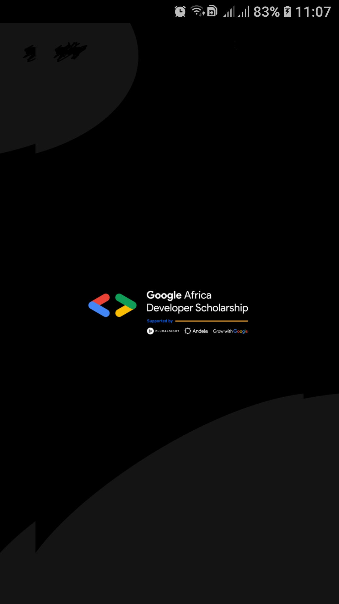
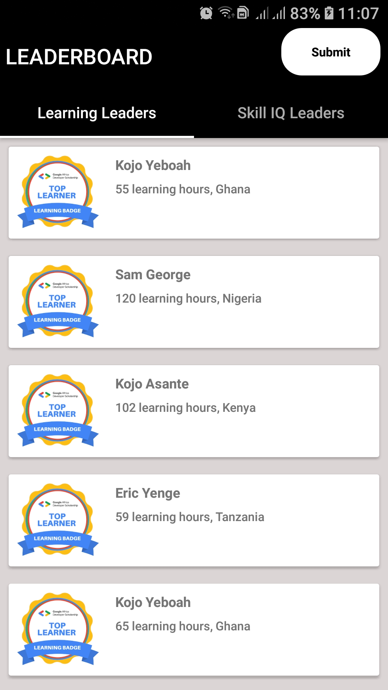
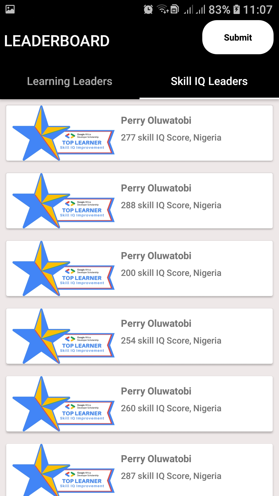
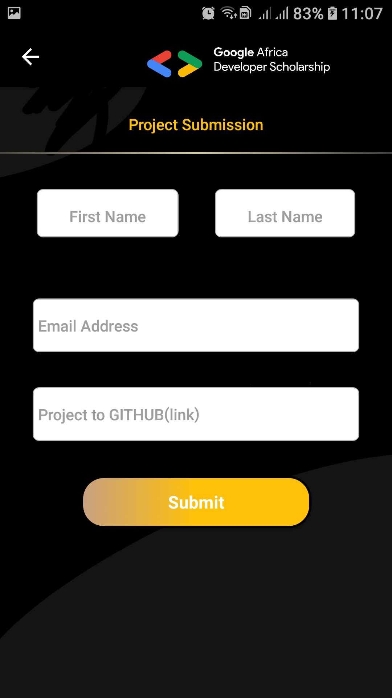
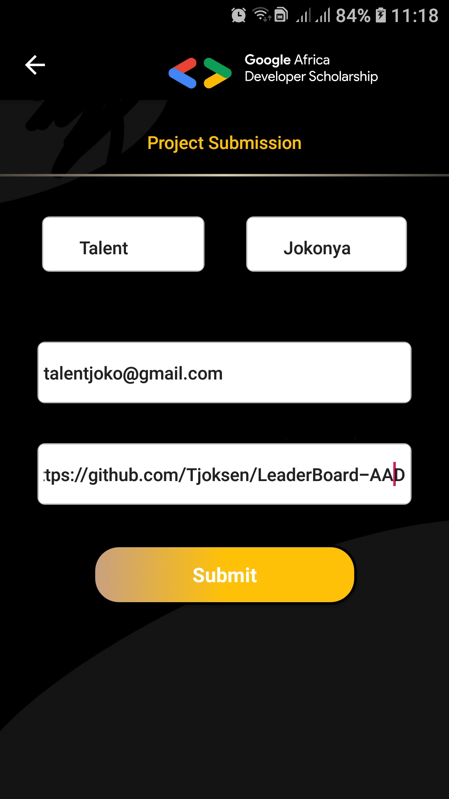
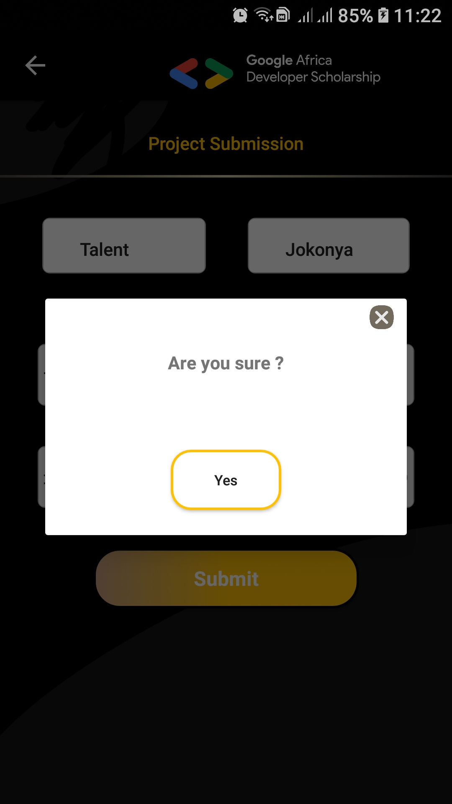
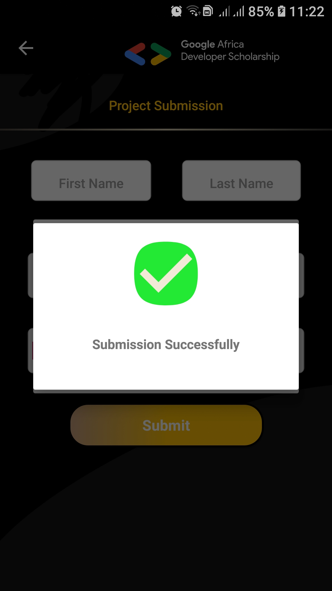
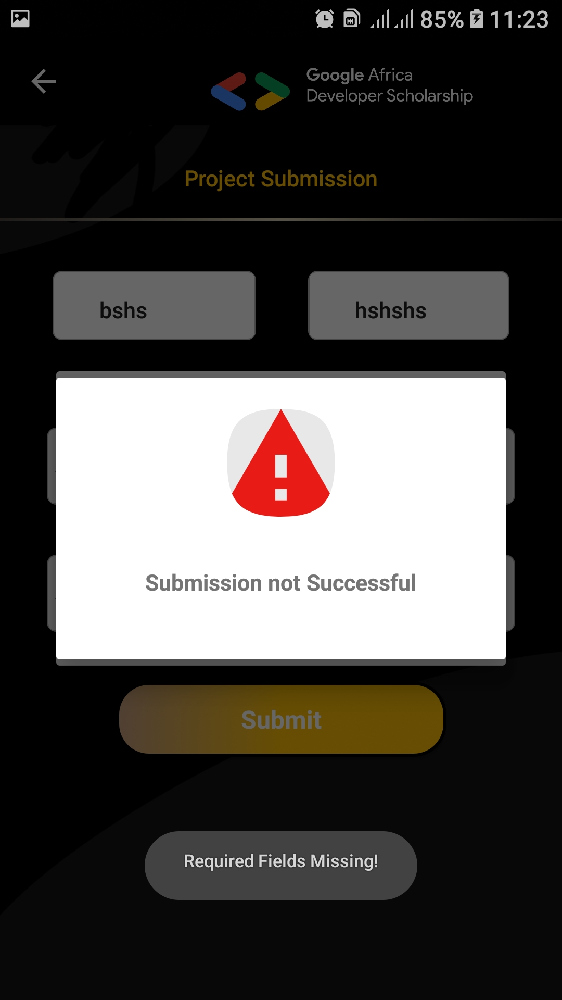

# LeaderBoard-AAD
This project consumes from a GADS api (leaderboard and skills api)
and present it in the android app. 
<b>KEY STACK </b> 
1.Android Studio 
2.Retrofit 
3.API 
4.Constraint Layout 
5.Google Forms 

<b>FUNCTIONALITY</b> 
-Consumes data from api and present it in api 
-Submit project via Google Forms 
<b>SCREENSHOTS</b> 

 

